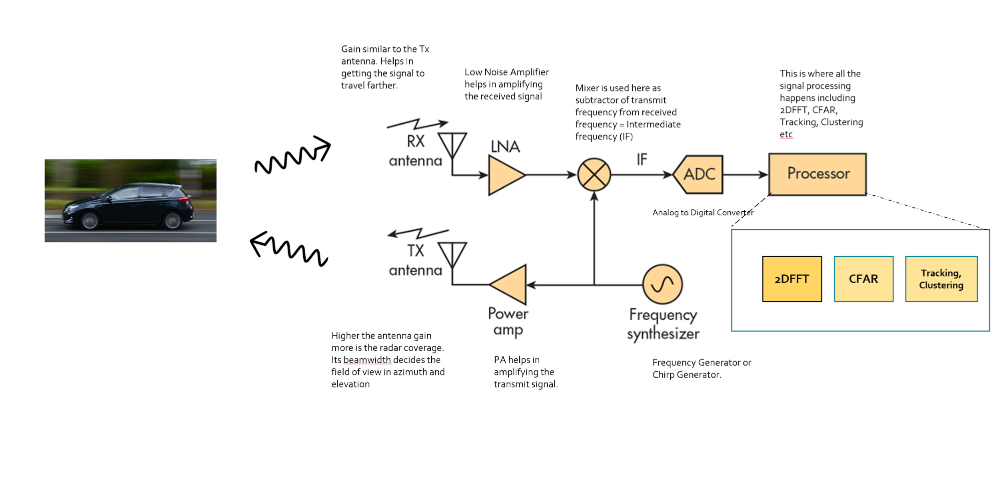

# Radar Target Generation and Detection

This work presents the algorithm and results obtained with the third project proposed by Udacity Sensor Fusion Engineer Nanodegree program. The main task of this project is the target localization and velocity estimation with FMCW radar (Frequency-Modulated Continuous Wave radar) signals. The target detection with radars is possible due to the doppler effect of the transmited signal with the received signal (electromagnetic waves). The schematic of radar is shown in the figure bellow.

  
  <em> Fig. 1 - Schematic of radar (Source: Udacity)</em>

The radar can sense the angle of the return signal by steering the antenna beam at the programmed angles. I is done by a constant phase increments, as illustrated in the figure bellow, where Φ are electronic components (Phase shifters) responsible for the phase changes to make the beam steer in a desired direction.

  
  <em> Fig. 2 - Beam Steering Design (Source: analog.com)</em>

In this project the following Radar Specifications are used:
  - Frequency of operation = 77GHz
  - Max Range = 200m
  - Range Resolution = 1 m
  - Max Velocity = 100 m/s

## Algorithm

**Step 1 - FMCW Waveform Generation:** Design the FMCW waveform by Calculating the Bandwidth (B), Chirp Time (Tchirp) and Slope (slope) according to Radar Specifications.

**Step 2 - Signal generation and Moving Target simulation:** With a defined Range of the Target for constant velocity, update the transmitted and received signal and then find the beat signal (fb).

  
  <em> Fig. 3 - FMCW (Source: emagtech, modified figure)</em>

**Step 3 - RANGE DOPPLER RESPONSE:** First, reshape the beat signal vector into Number_of_chirps x Number_of_samples_on_each_chirp array. Then, run a 2D FFT (Fast Furrier Transform) on the mixed signal (beat signal) output and generate a range doppler map (RDM). The output of Range Doppler response represents an image with Range on one axis and Doppler on the other.

  
  <em> Fig. 4 - SFND 2DFFT on FMCW Range and Doppler Estimation (Source: UDACITY)</em>

  
  <em> Fig. 5 - 2D FFT output</em>

**Step 4 - CFAR implementation:** 2D CFAR technique is used in the Range Doppler Map to resolve the false alarm issue (as ilustrated in figure 6).

  
  <em> Fig. 6 - False alarm (Source: UDACITY)</em>

The CFAR process is described as follows. Firstly, the number of training and guard cells are choosen (both number were empirically selected, in such a way that the 2D CFAR process ends up with good results). Secondly, the cell under test (CUT), together with the training and guard cells, slides across the grid (matrix). These cells arrangement is ilustrated in Fig. 7. On each iteration, the mean value of the training cells are calculated (mean signal level within training cells) and a offset value is added (This summed value is used as the threshold in the next step). If the signal level in CUT cell is greater than the calculated threshold, the CUT cell is assigned with value 1, otherwise with value 0 (zero). Finally, the non-thresholded cells at the edges are assigned with value 0 (zero). The  CFAR operation result is shown in Fig. 8.

  
  <em> Fig. 7 - CFAR Cells (Source: UDACITY)</em>

  
  <em> Fig. 8 - CFAR output</em>

